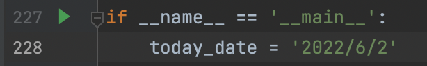

# 实习期间自制工具使用说明

## 第一步：将当日日期填写进代码228行，如'2020/6/1'
[]

## 第二步：运行代码

## 第三步：查看结果：见result中同名日期文件夹中

# 试用期转正通知发送逻辑：

当日 向 实际转正日期为当日 且 试用期转正审批流程为completed 的员工发送转正通知图片，图片中包含合同签约单位、入职日期、转正日期

收件人为员工本人，如员工 岗位族3=临床业务 ，则抄送直属主管、二级主管、部门负责人、大区经理、城市带教组长

如员工 岗位族3≠临床业务，则抄送直属主管、二级主管

# 已实现功能：

1. 一键实现所需信息誊至excel底表，存档发送记录
2. 一键实现生成jpg
3. 将发送记录记录到发送记录.xlsx中

 
# 反馈需求

在每个转正日反馈志平哥数据底表以及jpg

